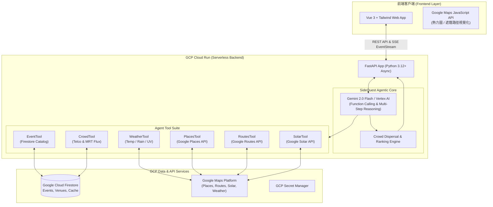
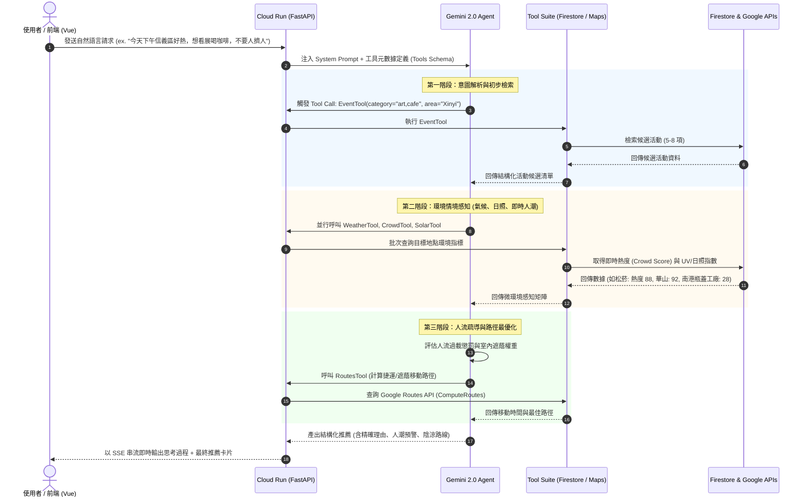

# SideQuest 實作提案與架構白皮書 (Implementation Proposal)
## Google DevJam 2026: Agent X 智慧城市｜GCP 雲端架構與後端實現方案

---

## 1. 提案摘要 (Executive Summary)
**SideQuest** 是一個基於 **Google Cloud Platform (GCP)** 與 **Gemini Agentic AI** 的智慧城市週末探險與活動決策平台。

本提案針對都會區活動資訊碎片化、熱門景點極端擁擠以及夏日高溫曝曬等問題，提出一套以 **Gemini 2.0 / Vertex AI 為大腦**，自主調用 **6 大專用工具 (Event, Weather, Crowd, Places, Routes, Solar)** 的多代理協作系統。透過即時動態感知、多準則決策演算法（Multi-Criteria Decision Making）與**人流智慧疏導（Crowd Dispersal Routing）**，SideQuest 不僅為使用者客製化最佳遊憩動線，更為城市創造「分散過載人潮、扶植小眾藝文聚落」之公共治理效益。

---

## 2. 系統架構設計 (System Architecture)

### 2.1 總體架構圖


---

## 3. Agent 核心決策與工具調用流程 (Agent Decision Graph)

### 3.1 決策工作流程 (Workflow)


---

## 4. 人流疏導與多準則評估演算法 (Crowd Dispersal Scoring Algorithm)

為了具體達成「分散人群、減少擁擠、提升遊憩品質」之目標，系統在 Agent 決策鏈中引入**動態加權評分公式**：

$$\text{TotalScore}(E_i) = S_{\text{match}}(E_i) \times w_{\text{match}} + (100 - C(E_i)) \times w_{\text{crowd}} + W_{\text{comfort}}(E_i) \times w_{\text{weather}} + A(E_i) \times w_{\text{access}}$$

其中：
- $S_{\text{match}}$: 使用者興趣與活動主題契合度 (0~100)
- $C(E_i)$: 即時人潮擁擠指數 (0~100)
- $W_{\text{comfort}}$: 微氣候舒適指數（若 UV 指數高但為室內活動則加分；若為烈日下戶外則扣分）
- $A(E_i)$: 交通易達性（距離捷運站步程與陰涼路徑覆蓋率）
- **Crowd Penalty (過載懲罰)**：當 $C(E_i) \ge 80$，系統主動降低其推薦排序，並在對話中提示：「*華山目前人潮指數高達 90，建議您可前往 10 分鐘捷運車程外的南港瓶蓋工廠手作展，人潮指數僅 28，享有更舒適的看展空間！*」

---

## 5. API 介面規格設計 (REST & SSE Specification)

### 5.1 Agent 互動端點
- `POST /api/v1/agent/chat/stream` (SSE Server-Sent Events)
  - 串流輸出 Agent 的思考、工具調用紀錄（Tool Invocation Traces）以及最終回答，提供前端極致流暢的 UI 體驗。
- `POST /api/v1/agent/recommend`
  - 快速單次呼叫，直接回傳多準則排序後的精選活動卡片結構化 JSON。

### 5.2 城市活動與地圖圖層端點
- `GET /api/v1/events`：檢索活動清單（支援分類、關鍵字、地理圍欄、室內/室外篩選）。
- `GET /api/v1/events/{event_id}`：活動詳細資訊（包含 Google Places 評價、圖片、即時人流）。
- `GET /api/v1/crowd/heatmap`：提供前端 Google Maps 渲染人潮熱力圖所需之經緯度權重點。
- `GET /api/v1/weather/current`：指定經緯度之微氣候、降雨機率與 UV 指數。

### 5.3 系統維運端點
- `GET /healthz`：Kubernetes / Cloud Run 存活探針 (Liveness probe)。
- `GET /readiness`：確認 Firestore、GCP 服務連線狀態 (Readiness probe)。

---

## 6. 資料庫模型設計 (Firestore Data Schema)

### 6.1 `events` Collection
```json
{
  "id": "event_taipei_art_01",
  "title": "2026 數位藝術未來特展",
  "category": "art",
  "venue_name": "松山文創園區 2號倉庫",
  "location": {
    "latitude": 25.0438,
    "longitude": 121.5607,
    "address": "台北市信義區光復南路133號"
  },
  "is_indoor": true,
  "ac_available": true,
  "start_time": "2026-08-20T10:00:00Z",
  "end_time": "2026-08-23T18:00:00Z",
  "tags": ["展覽", "科技藝術", "室內吹冷氣", "情侶約會"],
  "price_type": "free",
  "capacity": 300,
  "rating": 4.7,
  "source_url": "https://accupass.com/event/demo"
}
```

### 6.2 `venues_live` Collection (即時狀態快取)
```json
{
  "venue_id": "venue_songshan",
  "venue_name": "松山文創園區",
  "crowd_score": 78,
  "crowd_level": "HIGH",
  "uv_index": 7.5,
  "temperature_c": 33.2,
  "last_updated": "2026-08-17T16:00:00Z"
}
```

---

## 7. 雲端部署架構 (GCP Cloud Run Deployment)

```
                    ┌─────────────────────────┐
                    │      Git Repository     │
                    └────────────┬────────────┘
                                 │ git push
                                 ▼
                    ┌─────────────────────────┐
                    │    Google Cloud Build   │
                    │  - Docker build & test  │
                    │  - Push to Artifact Reg │
                    └────────────┬────────────┘
                                 │
                                 ▼
                    ┌─────────────────────────┐
                    │ GCP Artifact Registry   │
                    │ (gcr.io / asia-east1)   │
                    └────────────┬────────────┘
                                 │ deploy
                                 ▼
                    ┌─────────────────────────┐
                    │    Google Cloud Run     │
                    │ - Min instances: 0      │
                    │ - Max instances: 10     │
                    │ - Concurrency: 80       │
                    │ - Auto HTTPS (SSL)      │
                    │ - Secret Manager Bound  │
                    └─────────────────────────┘
```

### 7.1 Cloud Run 特性亮點
1. **極致彈性 (Scale to Zero)**：在無請求時縮容至 0 實例，節省運算成本。
2. **高併發 (Concurrency 80+)**：Python Async FastAPI 在單一 Container 即可處理高達 80 個並行請求。
3. **無縫整合 Secret Manager**：直接將 `GEMINI_API_KEY` 與 `MAPS_API_KEY` 掛載為環境變數，兼顧最高安全性。

---

## 8. 競賽致勝策略 (Hackathon Winning Strategy)

1. **技術實現與可行性 (30-35%)**：
   - 完整、乾淨、型別嚴謹的 Python 3.12+ FastAPI 非同步架構。
   - 優雅降級設計：具備完整 Realistic Mock Data，斷網或無金鑰環境仍能流暢展示。
2. **Google 技術運用與創新性 (25%)**：
   - 充分發揮 Gemini Function Calling 之自主決策能力。
   - 深度串聯 Google Maps Places, Routes, Solar, Weather 與 Cloud Run、Firestore。
3. **問題針對性與公共影響力 (20-25%)**：
   - 直擊都會週末「人擠人、曬傷、展覽踩雷」痛點。
   - 透過「人流疏導推薦演算法」協助智慧城市交通與商圈均衡發展。
4. **Demo 展示性 (15-20%)**：
   - 透過 SSE 串流將 Agent 思考每一步（如 "正在調用 Google Solar API 評估曝曬指數..."）動態可視化呈現，極具科技感與說服力。
